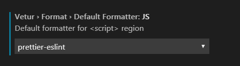

# React 开发规范

## IDE

推荐使用 `VSCode 1.32.3` 以上版本（含 `1.32.3`）

## 代码格式规范

- 代码格式化与校验

  代码格式化与校验采用：`ESLint` + `prettier`。在 VSCode 中做相应的设置:

  

* 声明规范

  - 函数声明

    推荐采用箭头函数写法，箭头函数写法的优点是自动绑定`this`对象

    ```jsx
    class HelloWorld extends Component {
      // 采用箭头函数方式声明函数
      helloWorldClickHandle = () => {};

      render() {
        return <div onClick={this.helloWorldClickHandle}>HelloWOrld</div>;
      }
    }
    ```

  - 属性与变量声明

    React 中的属性和变量主要有：对象内部属性，`state` 属性、函数内部变量和 `PropTypes` 属性。对象内部属性和 `state` 属性必须在 `construction` 函数中先定义。函数内部变量声明注意修饰符，变量用: `let`，常量用：`const`。`PropTypes` 声明如果是必输属性，必须加 `isRequired`修饰符。

    ```jsx
    class HelloWorld extends Component {
      construction(props) {
        super(props);

        this.objAtt = ""; // 对象内部属性在此定义
        this.state = {
          stateAtt: "" // state 属性在此定义
        };
      }
      // 采用箭头函数方式声明函数
      helloWorldClickHandle = () => {
        // 函数内部变量用：let
        let a = "";
        a = a + 1;
        console.log(a);
      };

      render() {
        // 函数内部常量用：const
        const { stateAtt } = this.state;
        return (
          <div onClick={this.helloWorldClickHandle}>HelloWOrld {stateAtt}</div>
        );
      }
    }

    // 定义 PropTypes
    HelloWorld.propTypes = {
      remove: PropTypes.func.isRequired
    };
    ```

* 命名规则

  - 函数命名规则

    函数命名采用第一个单词的首字母小写，其后单词的首字母大写的骆驼式命名法。如果属性名过长（超过 30 个字符）可以简写，简写字符采用大写方式。

    例如：`helloWorldClickHandle=()=>{}`

  - 属性和变量命名规则

    属性和变量命名采用第一个单词的首字母小写，其后单词的首字母大写的骆驼式命名法。如果属性名过长（超过 30 个字符）可以简写，简写字符采用大写方式。

    例如：`userCode`

## 生命周期函数使用规范

- componentWillReceiveProps

  尽量不要在`componentWillReceiveProps`中做`setState`操作，因此正常情况下`props`的变化将自动重新渲染界面。如果某一个功能必须在`componentWillReceiveProps`中操作`setState`，特别注意需要做缓存处理。

  示例：

  ```jsx
  class HelloWorld extends Component {
    construction(props) {
      super(props);
      this.state = {
        stateAtt = "";
      };
    }
    componentWillReceiveProps=(nextProps)=>{
      const {stateAtt} = this.state;
      // 增加缓存判断
      if(nextProps && nextProps.stateAtt !== this.state.stateAtt){
        this.setState({stateAtt: nextProps.stateAtt});
      }
    }
    render() {
      return <div>HelloWOrld</div>;
    }
  }
  ```

- componentWillUpdate

  禁止在`componentWillUpdate`中做`setState`操作，将会导致死循环。

- componentWillMount

  在`componentWillMount`中做一些初始设置，动态事件监听等，注意动态设置的地方在组件销毁的时候需要释放。

- componentWillUnmount

  在`componentWillUnmount`中做一些资源释放操作，例如：事件销毁（详见下文中：性能&内存中的事件监听和移除）

## state 使用规范

> 强调：只有需要重新渲染的属性才放到`state`中。

在组件开发过程中只将修改后需要重新渲染界面的属性定义到`this.state`中（即：`this.setState({att: 'newdata'})`），对于不需要重新渲染界面，又需要在对象内部全局使用的属性直接定义到`this`对象上（即：`this.att = 'newdata'`）。

`this.att` 与 `this.state.att` 还有个最重要的区别：`this.att`是同步属性，`this.state.att`是异步属性。所以以下写法可能拿不到最新的`state`值:

```js
this.setState({ att: "newdata" });
console.log(this.state.att);
```

## 性能&内存

- 事件监听与移除

组件内动态监听事件需要注意事件的定义和销毁。推荐采用在`componentWillMount`中动态监听事件，在`componentWillUnmount`中动态销毁事件。

示例：

```jsx
class HelloWorld extends Component {
  componentWillMount() {
    // 定义事件
    document.addEventListener("mousedown", this.docClickHandle);
  }

  docClickHandle = e => {};

  componentWillUnmount() {
    // 移除事件
    document.removeEventListener("mousedown", this.docClickHandle);
  }

  render() {
    return <div>HelloWOrld</div>;
  }
}
```

- `key` 的使用规范

React 列表渲染时，需要通过`key`来标识列表每一项的唯一性，从而提高操作型列表（对列表内容做增，删，改操作）页性能。

默认情况下如果未设置`key`，`React`会自动采用对应列表中的索引`index`做`key`。这种方式对于只是显示型列表来说也是没有问题的。但是对于操作型列表来说，变更操作（特别是删除与新增）对应索引会变化，将导致整个列表渲染（而不是差异化渲染）。

因此推荐使用的`key`是数据项中的唯一标识属性，例如：`id`。

> 特别注意：不要使用动态`uuid`方式，动态`uuid`方式解除了`react`中`key`的警告，但是每次渲染都会重新生成新的`uuid`，导致列表属性渲染。
>
> 示例：`<li key={uuid()}> </li>`

示例：

```jsx
class HelloWorld extends Component {
  construction(props) {
    super(props);
    this.state = {
      data: [
        { label: "item1", id: "item-id-1" },
        { label: "item1", id: "item-id-1" }
      ]
    };
  }

  render() {
    const { data } = this.state;
    return (
      <div>
        HelloWOrld List:
        <ul>
          {data && data.map(item=>{
            return <li key={item.id}>{item.label}</l>
          })}
        </ul>
      </div>
    );
  }
}
```

- 垃圾清理

> 使用具备垃圾收集机制的语言编写程序，开发人员一般不必操心内存管理的问题。但是， JavaScript
> 在进行内存管理及垃圾收集时面临的问题还是有点与众不同。其中最主要的一个问题，就是分配给 Web
> 浏览器的可用内存数量通常要比分配给桌面应用程序的少。这样做的目的主要是出于安全方面的考虑，
> 目的是防止运行 JavaScript 的网页耗尽全部系统内存而导致系统崩溃。内存限制问题不仅会影响给变量
> 分配内存，同时还会影响调用栈以及在一个线程中能够同时执行的语句数量。
> 因此，确保占用最少的内存可以让页面获得更好的性能。而优化内存占用的最佳方式，就是为执行
> 中的代码只保存必要的数据。一旦数据不再有用，最好通过将其值设置为 null 来释放其引用——这个
> 做法叫做 **解除引用**（dereferencing）。这一做法适用于大多数全局变量和全局对象的属性。

- 局部变量

正常情况下，局部变量会在它们离开执行环境时自动被解除引用。特别注意：如果使用闭包，需要对闭包函数做销毁，函数内部的变量也将自动销毁。

```js
function createPerson(name) {
  let att = ""; // 函数内部局部变量
}
```

- 全局对象

```js
function createPerson(name) {
  var localPerson = new Object();
  localPerson.name = name;
  return localPerson;
}
var globalPerson = createPerson("Nicholas");
// 手工解除 globalPerson 的引用
globalPerson = null;
```
