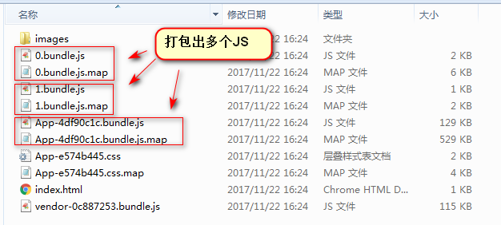
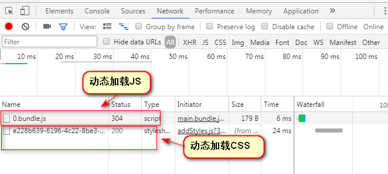

# Code Splitting And Module
代码拆分和模块化这两个最开始我认为是一个东西，在通过Webpack做Code Splitting之后发现他们还是有区别的。

## Module

先说说Module把，随着前端应用的复杂，为了提高开发效率和降低维护成本，生产环境的功能模块化自然而然的产生。生产环境的模块化一定要有一个伴侣就是：热插拔。

> 热插拔（hot-plugging或Hot Swap）：这个应该很好理解，来源于插座。插座是一直通电的，当你的电器（如：充电器）需要使用的时候通过插头接入插座。热插拔在系统应用中的体现是不中断服务（后端：重启服务；前端：手动刷新页面），实现功能的动态接入和退出。

现在对热插拔有一定的了解了，在看看Code Splitting。

## Code Splitting

Code Splitting 的中文翻译：代码分割。从名字上开就觉得这个是在开发层所做的事情，如同它的名字一样是将大代码块分割成多个小块。然后分块加载各自的小块的代码。

## 区别

看完上面应该会觉得：为什么我在Module节点的时候说热插拔，而在Code Splitting的时候我没有提及热插拔。这个也是我认为的这两个有区别，而且有较大区别的原因。

前面说到热插拔的两个概念：动态接入 和 动态退出。Code Splitting 和 Module都支持动态接入，而动态退出只有Module具有这个功能。下面分析一下我为什么这么认为。

在做Webpack 打包前端应用的时候，因为考虑首屏加载速度问题，因此做了Code Splitting ，然后编译的时候会有多个独立的文件

达到了我们首屏加载优化和按需加载的功能。但是我发现这个文件加载过一次之后,再次打开同样的功能的时候，不会再次请求（这里特别注意：不是请求返回304，而是连请求都没有发出）。

## 总结

通过上面的区别对比，我认为Module和Code Splitting是不一样的。Module在接入的时候有一个版本比对（更新策略）的过程（类似：浏览器的lastModified 和 Exspire 整合的更新策略）。而Code Splitting只是将代码拆分，需要加载的时候加入整个应用（或者说内存）,如果有版本变更要动态更新，需要整个应用重新进行加载（如：手动刷新整个网页）。

总结一句话：Module 和 Code Splitting 的区别在于：是否支持热插拔

## 其他

- Module 应用的案例

    内网站点（不考虑SEO）前端模块化最常用的就是使用：iframe。iframe每次接入都有版本比对策略，在前端应用不中断的情况下（不做手动刷新），模块动态部署前端会加载到新的网页。

- Webpack Code Splitting三种方式
    
    entry、CommonsChunkPlugin 和 dynamic Import 。这三个模式属于Module 的是：entry。另外两个属于 `Code Splitting` 。

